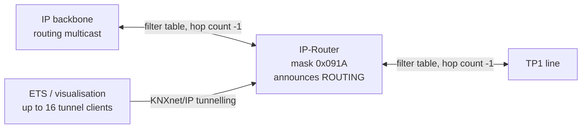

# OAM-IP-Router

OpenKNX **KNX IP Router** — a KNXnet/IP coupler between an IP backbone and a TP1 line, with 16 tunnelling
channels on top. Built on KNX mask `0x091A`, so it advertises the **ROUTING** service family and acts as a
coupler: it forwards, filters and decrements hop counts between the two media.

Runs on RP2040 (Pico / Pico 2 / Pico W), ESP32 and ESP32-S3, with a Wiznet W5500 Ethernet PHY or native
Ethernet. Shares the common OpenKNX libraries (`knx`, `TPUart`, `OGM-*`, `OFM-*`) via workspace symlinks.

> Looking for a device that offers a **hardware busmonitor** over ETS? That is the sibling product
> [OAM-IP-Interface](../OAM-IP-Interface) — a device advertising ROUTING cannot provide one.

---

## What it is

- **A coupler, not a device.** Mask `0x091A` brings the coupler network layer: a filter table, hop-count
  handling and the two-sided forwarding decision. The product carries **no group objects** — everything it
  does is routing, tunnelling and diagnostics.
- **Its role follows its address.** `x.0.0` makes it a backbone coupler between IP and main line `x.0`,
  `x.y.0` a line coupler for line `x.y`. An address carrying a device part is not a router at all — the
  `ipro` console command names that case instead of pretending to a role it cannot fulfil.

## Features

### Routing
- **Filter table** from ETS decides what crosses between IP and TP, per direction.
- **Hop count** decremented on every routed telegram, per AN189: a hop count of 7 no longer bypasses the
  filter table.
- **Routing counters** — telegrams routed towards IP and towards TP, and how many were filtered in each
  direction. Previously invisible: a router whose filter table blocks everything looked identical to an
  idle one.
- **Foreign-line tunnel unicast stays off TP** (`KNX_TUNNELING_STRICT_TOPOLOGY`). Correct coupler
  behaviour, and it removed a protocol-error flood seen when programming 1.x devices through a 2.0.0
  router.

### KNXnet/IP tunnelling
- **16 tunnel channels** plus 2 device-management connections.
- **Server-side retransmit** of `TUNNELLING_REQUEST` and `DEVICE_CONFIGURATION` with a FIFO queue: 1 s and
  one repeat for data, 10 s and three repeats for configuration. Under routing load it drops best-effort
  group frames rather than the connection.
- **Tunnel reservation** — a tunnel, with its own individual address, can be bound to a client IP. If it
  is busy the request can be rejected, handed the next free tunnel, or take the connection over.
- **No tunnel PA on TP** — unicast to an address that belongs to an open tunnel is not put on the line.

### Counters & diagnostics
- **KNXnet/IP telegram counters** (03_08_03 2.5.23-2.5.26) — `PID_MSG_TRANSMIT_TO_IP/KNX` and
  `PID_QUEUE_OVERFLOW_TO_IP/KNX`, readable by ETS. `->IP` counts every KNXnet/IP datagram the device
  sends, tunnelling and ACKs included, as the specification requires.
- **Bus load** — TP1 line occupancy per second, reconstructed from the 03_02_02 frame timings (character,
  ACK window, bus-free time), so a saturated line reads 100 % whatever the telegram length. Kept with a
  one-minute average and a peak.
- **Download counter** — `PID_DOWNLOAD_COUNTER` on the device object.
- **`ipro` console command** — coupler role and coupled line, routing multicast and TTL, open tunnels, the
  routing counters per direction, the KNXnet/IP telegram counters and bus load. `ipro reset` clears the
  bus-load history before a measurement.
- **`tun` console command** — active tunnels with type, client and uptime, plus the last 32
  connect/disconnect events with the reason.
- **`apdu` / `route apdu`** — read and set the APDU length properties.

### File Transfer & remote Console (FTC)
The OpenKNX **FileTransferModule** runs over the KNXnet/IP tunnel — no extra port, no serial cable. From a
PC you can open an interactive console on the device, transfer and manage files, push a firmware image and
trigger the update, and address or discover devices on the line. Access control is compiled in
(`OPENKNX_FTC_SECURITY`): the stage and password are configured in ETS, and the share carries no
communication objects, so the router stays free of group objects.

Firmware can also be pushed as a **difference** instead of a whole image, which matters on the 2 MB boards.

- **Start here:** [QUICKSTART](https://github.com/OpenKNX/OFM-FileTransferModule/blob/ec/v1dev/doc/QUICKSTART.md) — five minutes, three front ends, one first firmware update
- **Doc index:** [doc/README.md](https://github.com/OpenKNX/OFM-FileTransferModule/blob/ec/v1dev/doc/README.md) — every document with the audience it is written for
- **Host client:** [FTC-CLI](https://github.com/OpenKNX/OFM-FileTransferModule/blob/ec/v1dev/doc/FTC-CLI.md) · [ftc-cli/README.md](https://github.com/OpenKNX/OFM-FileTransferModule/blob/ec/v1dev/ftc-cli/README.md)
- **Firmware over the bus:** [FIRMWARE-UPDATE](https://github.com/OpenKNX/OFM-FileTransferModule/blob/ec/v1dev/doc/FIRMWARE-UPDATE.md)
- **Wire protocol:** [PROTOCOL](https://github.com/OpenKNX/OFM-FileTransferModule/blob/ec/v1dev/doc/PROTOCOL.md)

### Web interface

Every build with `OPENKNX_WEBSERVER` serves a small web front end on the device — no app, no cloud, no
extra tool. The menu is assembled by the modules that are compiled in:

| Page | What it does |
|---|---|
| **Übersicht** `/` | device identity, network state, uptime, and the prog-mode button |
| **Dateimanager** `/filemanager` | browse, upload, download, delete and rename files on the device flash, create folders, and fetch a file straight from a URL onto the device |
| **knxOTA** `/knxota` | push a firmware image to *another* device over the KNX bus, as a whole image or as a difference |
| **Gerätekonsole** `/console` | the full device console in the browser over a WebSocket — the same commands as on the serial line |
| **Tunnel** `/tunnels` | the open tunnel connections with type, client address and uptime, plus the recent connect and disconnect history with the reason |
| **Gruppenmonitor** `/groupmonitor` | live group telegrams, without ETS |
| **Display** `/display` | a live image of the OLED, the joystick as buttons, and editors for the widgets and display settings |

### What the REG2 variants add

The REG2 boards carry an **OLED display and an SD-card slot**, so they show and store more than a bare
REG1 build:

- **On screen, without any tool:** the product page, system info with a diagnose page (heap and stack
  low-water marks, watchdog resets, chip and clock), the bus widget with load and BCU health, and the
  network widgets with link state and LAN throughput. Rotation runs on its own; the manager corner shows
  whether it is running or paused.
- **Operated by the five-way joystick** or from the `/display` web page — including a menu that edits
  settings and the network configuration on the device itself.
- **On the SD card:** file transfers can target `sd/` instead of the internal flash, framebuffer
  screenshots can be written as 1-bit BMP, and there is room for logs and firmware images that the
  2 MB internal flash could never hold.

### Network services
- **Web interface** — status, tunnel list, file manager, web console and a knxOTA page for
  device-to-device firmware transfer over the bus.
- **NTP** time synchronisation, **mDNS / DNS-SD** discovery (`_openknx._tcp`), **OTA** over the network.
- **OLED display** widgets: router page, system info, bus and network widgets from the shared modules.
- **W5500 main-loop RX** — Ethernet receive and lwIP timers are pumped from the main loop rather than a
  preemptive interrupt, for predictable behaviour under heavy routing load.

## KNX conformance

The implementation follows the KNX specification, and that is checked rather than assumed.
`scripts/Test/Suites/` holds **95 test cases** in seven suites — Core, Device Management, Tunnelling,
Routing, Remote Diagnosis, IP Medium and a device suite — and every case names the clause it verifies:

| Clause | What it covers here |
|---|---|
| **03_08_02** Core | the Supported Service Families DIB — this device announces ROUTING alongside Core, Device Management and Tunnelling |
| **03_08_05** Routing | the routing service this device announces, and the multicast it uses |
| **03_08_04 §2.6.1**, **03_08_03** | tunnelling and device-configuration retransmit timing (1 s / 1 repeat for data, 10 s / 3 for configuration) |
| **03_08_03 §2.5.23-2.5.26** | the KNXnet/IP telegram counters, saturating instead of wrapping as the standard demands |
| **03_03_04** Transport Layer | connection timeout, invalid PDUs, the event and action state machine |
| **03_05_01** Resources | the device-object properties ETS reads, including the download counter |
| **03_02_02** Communication Medium TP1 | the character, ACK and bus-free timings the bus-load figure is built on |
| **AN189** | a hop count of 7 no longer bypasses the filter table |

Two deliberate exceptions, both marked as such where they appear: the FTC **fast** and **forget** upload
modes trade protocol silence for speed and step outside the specification. They are experimental, off by
default, and work only between OpenKNX devices.

**Open source, and what that means here.** The behaviour was evaluated against the specification with the
scripted suites above, driving a real device, each case naming the clause it verifies. Where a measurement
contradicted an assumption, the assumption was corrected — not the measurement. Everything was implemented
to the best of the author's knowledge and belief.

**Nothing is guaranteed.** This is not a KNX certification; that is a separate formal process and is not
claimed. The software is provided **as is**, without warranty of any kind, express or implied — see the
licence for the binding wording. You run it on your own installation at your own risk.

## How it sits in the installation



Both directions are governed by the filter table, and every routed telegram has its hop count decremented.
Tunnelling runs alongside that: a client reaches the line through the router without taking part in
routing itself.

## Supported hardware

| Env | Platform | Flash | Ethernet |
|---|---|---|---|
| `release_REG2_PICO_ETH_DD` (default) | RP2040 | 2 MB | W5500 |
| `release_REG2_PICO2_ETH_DD` | RP2350 (Pico 2) | 4 MB | W5500 |
| `release_REG2_PICO_W_ETH_DD` | RP2040 (Pico W) | 2 MB | W5500, LAN only |
| `release_REG2_PICO_ESP_ETH_DD` | ESP32-S3 | 16 MB | W5500 |
| `release_REG1_ETH` | RP2040 | 16 MB | W5500, no display/SD |
| `release_REG1_LAN_TP_BASE` | ESP32 (classic) | 8 MB | native |

Both ESP environments carry the board id `esp32dev`; only `REG2_PICO_ESP_ETH_DD` overrides
`board_build.mcu` to `esp32s3`, so the MCU column follows that override rather than the board name.

## Build & flash

```bash
pwsh scripts/Build-Release.ps1                # DEV build (default) — firmware + zip
pwsh scripts/Build-Release.ps1 -Release       # RELEASE build (explicit flag required)
pwsh scripts/Build-Release.ps1 -Full          # all variants
pwsh scripts/Build-Release.ps1 -SkipFirmware  # regenerate configs/knxprod only
pwsh scripts/Build-Release.ps1 -Clean         # remove generated files and exit
```

Individual steps:

```bash
pio run -e release_REG2_PICO_ETH_DD        # RP2040
pio run -e release_REG2_PICO_ESP_ETH_DD    # ESP32-S3
```

The release build writes `dependencies.txt`, which pins the exact library commits the image was built
from — a plain `pio run` does not refresh it.

## ETS product identity

| | |
|---|---|
| Mask version | `MV-091A` |
| OpenKnxId | `0xA1` |
| ApplicationNumber | `30` (Dev) · `31` (Release) |
| Version | **Dev `7.8.0`** · **Release `0.7`** |
| Group objects | none — the product is a coupler |

## Documentation

- [`CHANGELOG.md`](CHANGELOG.md) — release history back to the first published generation.
- `scripts/Test/` — the suite-based test framework driven by `Run-Tests`.

## Status

Alpha dev build for testers. Routing, tunnelling, the counters and the web interface run on hardware; the
routing counters and the towards-TP telegram counter have not yet been measured against a known load.

## Authors & license

Originally created by **Ing-Dom** for OpenKNX. This branch — routing and KNXnet/IP counters, bus load,
the `ipro` console, the web interface, FTC and the display work — is maintained by **Erkan Çolak**,
with further contributions by Waldemar Porscha and others.

Licensed under the **GNU Affero General Public License v3** — see [LICENSE](LICENSE).

Built on the OpenKNX platform and its shared libraries (`knx`, `TPUart`, `OGM-*`, `OFM-*`), each with its
own authors and licence.
